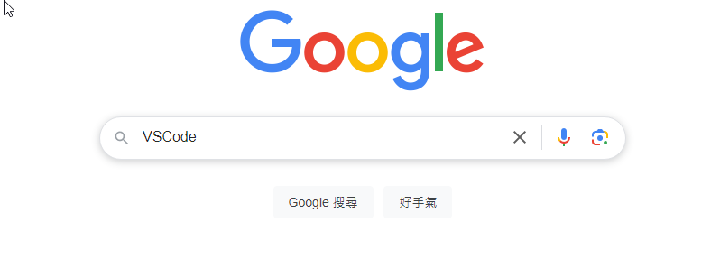
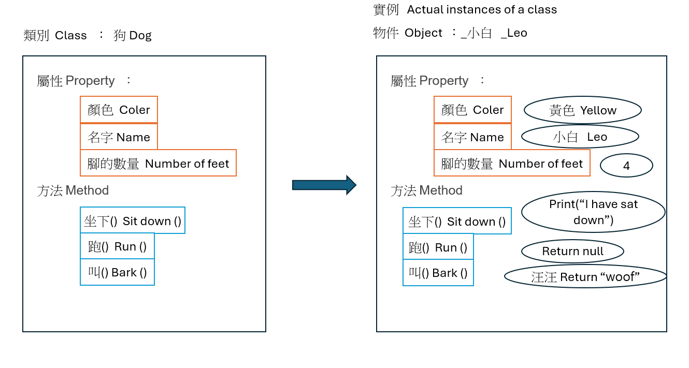

# 第一週：課程目的、開發環境設置與基礎工具安裝、物件導向基礎

Week 1: Course Purpose, Development Environment Setup, Basic Tools Installation, and Object-Oriented Fundamentals


## 課程概述 Course Overview

本週將介紹課程目標、建立開發環境，並學習物件導向程式設計的基礎概念。我們會從環境設置開始，到理解物件導向的基本概念，並完成第一個Python程式。
This week introduces course objectives, sets up the development environment, and covers object-oriented programming fundamentals. We'll start from environment setup to understanding object-oriented concepts, and complete our first Python program.

## 章節 Chapters

1. 專案結構
   Project structure
2. Python 安裝
   Python Installation
3. VS Code 開發環境設置
   VS Code Development Environment Setup
4. Python Hello World 測試
   Python Hello World Test
5. 物件導向基礎概念
   Object-Oriented Programming Fundamentals

## 課程內容 Course Content

### 1. 系統結構

System structure

#### **前後端關係 Frontend-Backend Relationship**


前端、後端和資料庫各自扮演不同但互相配合的角色：
Frontend, backend, and database each play different but complementary roles:

#### **前端 Frontend**

前端負責使用者介面和互動:
The frontend is responsible for user interface and interaction:

- 呈現畫面給使用者看
  Display screens for users to view
- 處理使用者的操作(如點擊、輸入)
  Handle user operations (such as clicks, inputs)
- 將使用者的要求傳給後端
  Send user requests to the backend
- 使用 HTML、CSS、JavaScript 等技術
  Use technologies like HTML, CSS, JavaScript, etc.

#### **後端 Backend**

後端負責商業邏輯和資料處理:
The backend is responsible for business logic and data processing:

- 接收並處理前端的請求
  Receive and process requests from the frontend
- 進行各種運算和邏輯判斷
  Perform various calculations and logical judgments
- 和資料庫溝通存取資料
  Communicate with the database to access data
- 使用 Python、Java、PHP 等程式語言
  Use programming languages such as Python, Java, PHP, etc.

#### **資料庫 Database**

資料庫負責資料的儲存和管理:
The database is responsible for data storage and management:

- 儲存應用程式需要的各種資料
  Store various data needed by the application
- 提供資料的新增、查詢、修改、刪除功能
  Provide functions for adding, querying, modifying, and deleting data
- 確保資料的一致性和安全性
  Ensure data consistency and security
- 常見如MSSQL、 MySQL、PostgreSQL、MongoDB 等
  Common examples include MSSQL,MySQL, PostgreSQL, MongoDB, etc.

三者協同運作的流程:
The workflow of the three working together:

1. 使用者在前端操作介面
   Users operate the interface on the frontend
2. 前端將要求送到後端處理
   The frontend sends requests to the backend for processing
3. 後端視需要向資料庫存取資料
   The backend accesses data from the database as needed
4. 後端處理完成後回傳結果給前端
   After processing, the backend returns results to the frontend
5. 前端將結果呈現給使用者
   The frontend presents the results to the user

### 2. Python 安裝

Python Installation

- Python 官方網站下載
  Python Official Website Download
  [https://www.python.org/downloads/](https://www.python.org/downloads/)
  
- 安裝步驟
  Installation Steps

  1. 下載 Python 安裝檔
     Download Python Installer
  2. 執行安裝檔並勾選 "Add Python to PATH"、"Use admin privileges when installing py.exe"
     Run installer and check "Add Python to PATH","Use admin privileges when installing py.exe"
  3. 點選「Install Now」
     Click "Install Now"
     
  4. 完成安裝
     Complete Installation
- 驗證安裝
  Verify Installation

  1. 開啟命令提示字元
     Open Command Prompt
  2. 輸入指令確認版本
     Enter command to check version
     
     ```
     python --version
     ```

#### 練習：

Practice:

1. 安裝 Python 最新版本
   Install the latest version of Python
2. 確認安裝成功
   Confirm successful installation

### 3. VS Code 開發環境設置

VS Code Development Environment Setup

- VS Code 下載與安裝
  VS Code Download and Installation
  [https://code.visualstudio.com/download](https://code.visualstudio.com/download)
  
- 
- 
- 擴充套件安裝
  Essential Extensions Installation

  - 繁體中文 Chinese (Traditional) Language Pack
  - Python
  - Python Debugger
  - IntelliCode
  - Office Viewer(Markdown Editor)
- 基本設定配置
  Basic Configuration Setup

  1. 設定 Python 解釋器
     Set Python Interpreter
  2. 設定檔案自動儲存
     Set Auto Save

#### 練習：

Practice:

1. 安裝 VS Code 並完成基本設定
   Install VS Code and complete basic settings
2. 安裝所有推薦的擴充套件
   Install all recommended extensions
3. 建立一個新的 Python 專案資料夾
   Create a new Python project folder

### 4. Python Hello World 測試

Python Hello World Test

- 建立第一個 Python 檔案
  Create Your First Python File
  1. 在 VS Code 中建立新檔案 `hello.py`
     Create a new file `hello.py` in VS Code
  2. 編寫簡單的 Hello World 程式
     Write a simple Hello World program

```python
# 這是我的第一個 Python 程式
# This is my first Python program

print("Hello, World!")
print("歡迎來到 Python 與 React 全端開發實戰課程！")
print("Welcome to Python and React Full-Stack Development Course!")

# 使用變數
# Using variables
name = "學生"  # Student
course = "Python 與 React"  # Python and React

print(f"你好，{name}！歡迎學習 {course} 課程。")
print(f"Hello, {name}! Welcome to the {course} course.")

# 基本數學運算
# Basic math operations
a = 10
b = 12
print(f"a = {a}")
print(f"b = {b}")
print(f"a + b = {a + b}")

# 使用 input() 函數接收使用者輸入
# Using input() function to receive user input
print("\n--- 互動式對話 Interactive Dialogue ---")

user_age = input("請問您幾歲了？ (How old are you?): ")
print(f"原來您已經 {user_age} 歲了，祝您身體健康！")
print(f"So you are {user_age} years old. Wish you good health!")


```

- 執行 Python 程式
  Run Python Program
  1. 在 VS Code 中使用右上角的執行按鈕
     Use the run button in the top right corner of VS Code
  2. 或使用終端機指令 `python hello.py`
     Or use terminal command `python hello.py`
  3. 觀察輸出結果
     Observe the output

#### 練習：

Practice:

1. 修改 Hello World 程式，加入自己的名字和感興趣的主題
   Modify the Hello World program to include your name and topics of interest
2. 使用變數儲存兩個數字，並輸出它們的加、減、乘、除結果
   Use variables to store two numbers and output their addition, subtraction, multiplication, and division results
3. 創建一個簡單的計算機程式，使用 `input()` 函數接收兩個數字，然後顯示它們的加、減、乘、除結果
   Create a simple calculator program using the `input()` function to receive two numbers, then display their addition, subtraction, multiplication, and division re
4. sults
5. 設計一個問答，使用 `input()` 函數提問，並根據使用者的回答給出不同的回應
   Design a Q&A game using the `input()` function to ask questions and provide different responses based on the user's answers

### 5. 物件導向基礎概念

Object-Oriented Programming Fundamentals



- 類別 (Class)

  - 類別是一個物件的藍圖或模板
  - 定義了物件應該具有的屬性和行為
  - 相當於創建物件的模具
    Class
  - A class is a blueprint or template for objects
  - Defines the attributes and behaviors objects should have
  - Acts like a mold for creating objects
- 屬性 (Properties)

  - 描述物件的特徵或狀態
  - 例如:狗的品種、年齡、體重等
  - 使用變數來儲存這些資料
    Properties
  - Describe object characteristics or states
  - Example: dog's breed, age, weight, etc.
  - Use variables to store this data
- 方法 (Methods)

  - 定義物件可以執行的行為或動作
  - 例如:狗可以叫、跑、吃等動作
  - 使用函式來實現這些行為
    Methods
  - Define behaviors or actions objects can perform
  - Example: dog can bark, run, eat, etc.
  - Implement these behaviors using functions
- 物件 (Objects)

  - 類別的實際實例
  - 具有類別定義的所有屬性和方法
  - 每個物件都是獨立的個體
    Objects
  - Actual instances of a class
  - Have all properties and methods defined by the class
  - Each object is an independent entity

#### Python 類別範例 Python Class Example:

```python
# 使用 Pydantic 的 BaseModel 簡化類別定義
# Using Pydantic's BaseModel to simplify class definition
from pydantic import BaseModel
from typing import Optional

# 定義狗的類別，繼承自 BaseModel
# Define Dog class, inheriting from BaseModel
class Dog(BaseModel):
    name: str  # 名字屬性 Name property
    breed: str  # 品種屬性 Breed property
    age: int  # 年齡屬性 Age property
    weight: Optional[float] = None  # 體重屬性（選填）Weight property (optional)
  
    # 方法可以直接使用類別的屬性，不需要 self
    # Methods can directly use class attributes without self
    def bark(self):
        return f"{self.name} 汪汪叫！ ({self.name} is barking!)"
  
    def run(self):
        return f"{self.name} 正在跑步！ ({self.name} is running!)"
  
    def info(self):
        weight_info = f"，體重：{self.weight}公斤" if self.weight else ""
        return f"狗名：{self.name}，品種：{self.breed}，年齡：{self.age}歲{weight_info}"

# 創建狗的實例 Create dog instances
my_dog = Dog(name="小黑", breed="拉布拉多", age=3, weight=25.5)
your_dog = Dog(name="小白", breed="哈士奇", age=2)

# 使用方法 Using methods
print(my_dog.info())  # 輸出：狗名：小黑，品種：拉布拉多，年齡：3歲，體重：25.5公斤
print(my_dog.bark())  # 輸出：小黑 汪汪叫！ (小黑 is barking!)
print(your_dog.info())  # 輸出：狗名：小白，品種：哈士奇，年齡：2歲
print(your_dog.run())  # 輸出：小白 正在跑步！ (小白 is running!)

# BaseModel 的優點
# 1. 自動資料驗證 Automatic data validation
# 2. 簡化類別定義 Simplified class definition
# 3. 易於轉換為 JSON Easy to convert to JSON
print(my_dog.model_dump_json())  # 輸出 JSON 格式的資料
```

#### 練習：

Practice:

1. 安裝 Pydantic 套件：`pip install pydantic`
   Install Pydantic package: `pip install pydantic`
2. 建立一個 `Cat` 類別，繼承自 BaseModel，包含名字、品種、年齡屬性，以及叫聲、睡覺等方法
   Create a `Cat` class inheriting from BaseModel with name, breed, age properties, and methods for meowing and sleeping
3. 創建至少兩個不同的貓實例，並呼叫它們的方法
   Create at least two different cat instances and call their methods
4. 嘗試將貓實例轉換為 JSON 格式
   Try converting cat instances to JSON format

## 課程重點

Course Highlights

- Python 開發環境的正確設置是後續學習的基礎
  Proper setup of Python development environment is the foundation for subsequent learning
- 從簡單的 Hello World 程式開始，逐步理解 Python 的基本語法
  Starting from a simple Hello World program to gradually understand Python's basic syntax
- 物件導向程式設計是 Python 的核心概念之一
  Object-oriented programming is one of the core concepts of Python
- 理解類別、屬性、方法和物件之間的關係
  Understanding the relationship between classes, properties, methods, and objects
- 實際動手練習是掌握程式設計的最佳方式
  Hands-on practice is the best way to master programming

## 課程總結

Course Summary

本週我們完成了開發環境的設置，學習了物件導向程式設計的基礎概念，並創建了第一個 Python 程式。這些基礎知識將為後續課程打下堅實的基礎，特別是在開發翻譯工具應用時，物件導向的思維將幫助我們更好地組織和管理程式碼。

This week, we completed the setup of the development environment, learned the basic concepts of object-oriented programming, and created our first Python program. These foundational knowledge will lay a solid foundation for subsequent courses, especially when developing translation tool applications, object-oriented thinking will help us better organize and manage code.

## 下週預告

Next Week Preview

下週我們將深入學習 Python 翻譯套件的應用，包括 googletrans 套件的基本功能、異步程式設計基礎，以及錯誤處理實作。

Next week, we will delve into the application of Python translation packages, including the basic functions of the googletrans package, asynchronous programming basics, and error handling implementation.
