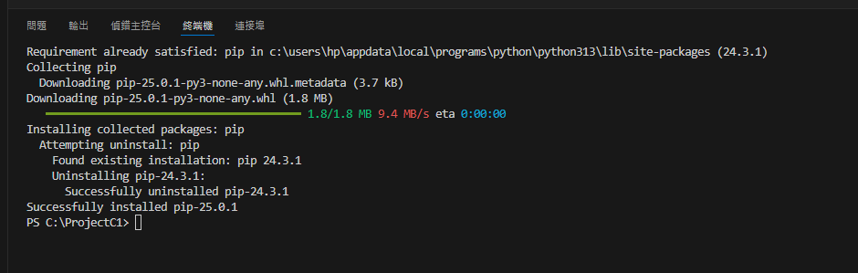
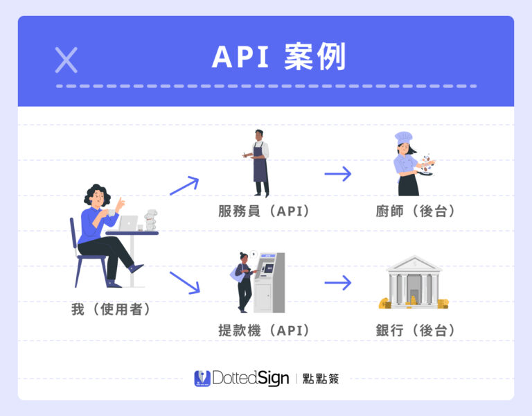

# 第二週：Python 翻譯套件應用

Week 2: Python Translation Package Application


## 課程概述 Course Overview

本週將介紹 Python 翻譯套件的應用，包括 googletrans 套件的基本功能。我們會從套件安裝開始，到實際應用翻譯功能，並學習如何處理可能發生的錯誤，最後介紹 WebAPI 的基本概念，為下週的 FastAPI 開發做準備。

This week we will introduce the application of Python translation suite, including the basic functions of googletrans suite. We will start from the installation of the package, to actually apply the translation function, and learn how to deal with errors that may occur. Finally, we will introduce the basic concepts of WebAPI to prepare for the FastAPI development next week.

## 學習目標 Learning Objectives

- 了解 Python 套件的安裝與使用方式
  Understand how to install and use Python packages
- 掌握 googletrans 套件的基本功能
  Master the basic functions of the googletrans package
- 理解 WebAPI 的基本概念
  Understand the basic concepts of WebAPI

## 章節 Chapters

1. Python 套件介紹與安裝
   Python Package Introduction and Installation
2. googletrans 套件基本功能
   Basic Functions of googletrans Package
3. WebAPI 概念介紹
   WebAPI Concept Introduction

## 課程內容 Course Content

### 1. Python 套件介紹與安裝

Python Package Introduction and Installation

#### **Python 標準庫（Standard Library）**

Python 內建了一些常用的標準庫，可以直接使用，無需額外安裝。例如：

| 標準庫       | 功能               |
| ------------ | ------------------ |
| `os`       | 檔案和目錄操作     |
| `sys`      | 系統參數與路徑管理 |
| `json`     | 讀寫 JSON          |
| `datetime` | 處理日期和時間     |
| `math`     | 數學運算           |
| `random`   | 隨機數相關功能     |

```python
# 標準庫使用範例
# Standard library usage examples
from datetime import datetime
print(f"現在時間是 {datetime.now()}")

import os
import math

print(os.getcwd())  # 取得當前目錄
print(math.sqrt(16))  # 4.0
```

#### **Python 第三方庫（Third-party Libraries）**

[https://pypi.org/project/googletrans/](https://pypi.org/project/googletrans/)

- pip 套件管理工具
  pip Package Management Tool

  ```bash
  # 更新 pip
  # Update pip
  python -m pip install --upgrade pip

  # 安裝 googletrans 套件
  # Install googletrans package
  pip install googletrans==4.0.0-rc1
  ```

  
- 套件導入方式
  Package Import Methods

  ```python
  # 導入整個套件
  # Import entire package
  import googletrans

  # 導入特定類別
  # Import specific class
  from googletrans import Translator
  ```

#### **課程重點 Key Points**

- Python 套件是擴展 Python 功能的重要方式
  Python packages are important ways to extend Python functionality
- pip 是 Python 的標準套件管理工具
  pip is the standard package management tool for Python
- 了解不同的套件導入方式有助於更有效地使用套件
  Understanding different package import methods helps to use packages more effectively

#### **練習 Practice**

1. 安裝 googletrans 套件
   Install googletrans package
2. 確認安裝成功
   Confirm successful installation
3. 嘗試不同的導入方式
   Try different import methods

### 2. googletrans 套件基本功能

Basic Functions of googletrans Package

#### **基本翻譯功能 Basic Translation Functions**

```python
# 建立翻譯器實例與基本翻譯
# Create translator instance and basic translation
import asyncio
from googletrans import Translator

async def basic_translate():
  
    print(f"basic_translate:")
    Tr = Translator()
    text = "你好，世界！"
    result = await Tr.translate(text, src='zh-tw', dest='en')
    print(f"原文 (Original): {text}")
    print(f"翻譯 (Translation): {result.text}")
    print(f"---------------------------------------")
  

async def basic_translate_cus():
  
    print(f"basic_translate_cus:")
    Tr = Translator()
    text = input("請輸入要翻譯的內容：")
    result = await Tr.translate(text, src='zh-tw', dest='en')
    print(f"原文 (Original): {text}")
    print(f"翻譯 (Translation): {result.text}")
    print(f"---------------------------------------")
  

# 自動語言偵測
# Auto language detection
async def detect_language():
  
    print(f"detect_language:")
    Tr = Translator()
    text = "こんにちは"
    detected = await Tr.detect(text)
    print(f"文字 (Text): {text}")
    print(f"偵測語言 (Detected language): {detected.lang}")
    print(f"---------------------------------------")

# 執行所有函數
asyncio.run(basic_translate())
asyncio.run(basic_translate_cus())
asyncio.run(detect_language())

```

#### **支援的語言 Supported Languages**

googletrans 支援多種語言，以下是常用的語言代碼：
googletrans supports multiple languages, below are commonly used language codes:

| 語言代碼  | 語言     |
| --------- | -------- |
| `en`    | 英語     |
| `zh-tw` | 繁體中文 |
| `zh-cn` | 簡體中文 |
| `ja`    | 日語     |
| `ko`    | 韓語     |
| `fr`    | 法語     |
| `de`    | 德語     |
| `es`    | 西班牙語 |

```python
# 列出所有支援的語言
# List all supported languages
from googletrans import LANGUAGES

for code, language in LANGUAGES.items():
    print(f"{code}: {language}")
```

#### **課程重點 Key Points**

- 可以指定源語言和目標語言
  Source and target languages can be specified
- 自動語言偵測功能可以識別輸入文字的語言
  Auto language detection can identify the language of input text

#### **練習 Practice**

1. 建立一個程式，讓使用者輸入文字和目標語言，然後顯示翻譯結果
   Create a program that allows users to input text and target language, then displays the translation result
2. 實作多語言翻譯功能，將輸入文字同時翻譯成多種語言
   Implement multi-language translation to translate input text into multiple languages simultaneously

### 3. WebAPI 概念介紹

WebAPI Concept Introduction

#### **什麼是 WebAPI What is WebAPI**

WebAPI（Web Application Programming Interface）是一種允許不同軟體系統通過網絡進行通信的介面：
WebAPI is an interface that allows different software systems to communicate over the network:

- 它使用 HTTP 協議進行通信
  It uses HTTP protocol for communication
- 通常返回 JSON 或 XML 格式的數據
  Usually returns data in JSON or XML format
- 常見 REST 或 GraphQL 等架構風格
  Common architectural styles such as REST or GraphQL

  引用自 [https://www.dottedsign.com/zh-tw/blog/product/api](https://www.dottedsign.com/zh-tw/blog/product/api)

  
- ### **簡單解釋 API**

  API 就像是「服務生」或「提款機」，它幫助我們（使用者）與後台系統（廚師、銀行）溝通。


  * **餐廳場景** ：你（使用者）告訴服務生（API）想要點什麼，服務生把訊息傳給廚師（後台），然後廚師做好餐點後，服務生再把食物送回來。
  * **提款機場景** ：你（使用者）操作提款機（API），它幫你向銀行（後台）請求提領金額，銀行確認後就讓提款機吐出現金。

  API 的角色就是 **中間橋樑** ，負責傳遞請求與回應，讓前端與後端順利運作。

  ---

  ### **Simple Explanation of API (Using This Image)**

  An API is like a **waiter** or an **ATM** that helps users communicate with backend systems (chefs, banks).

  * **Restaurant Example** : You (user) tell the waiter (API) what you want to order. The waiter passes the request to the chef (backend), who prepares the meal. Then, the waiter brings the food back to you.
  * **ATM Example** : You (user) use an ATM (API) to request cash. The ATM communicates with the bank (backend), and if everything checks out, the ATM dispenses money.

  The API acts as a **bridge** that connects requests and responses, ensuring smooth communication between the frontend and backend.

#### **API 請求與響應 API Request and Response**

## 課程總結 Course Summary

本週我們學習了 Python 翻譯套件的應用，包括：
This week we learned about the application of Python translation packages, including:

- Python 套件的安裝與使用
  Installation and use of Python packages
- googletrans 套件的基本功能
  Basic functions of the googletrans package
- WebAPI 的基本概念
  Basic concepts of WebAPI

這些知識為我們下週學習 FastAPI 框架和開發 Web API 奠定了基礎。
This knowledge lays the foundation for learning the FastAPI framework and developing Web APIs next week.

## 延伸閱讀 Further Reading

- [googletrans 官方文檔](https://py-googletrans.readthedocs.io/)
- [Python asyncio 官方文檔](https://docs.python.org/3/library/asyncio.html)
- [RESTful API 設計指南](https://restfulapi.net/)
- [HTTP 狀態碼參考](https://developer.mozilla.org/en-US/docs/Web/HTTP/Status)
