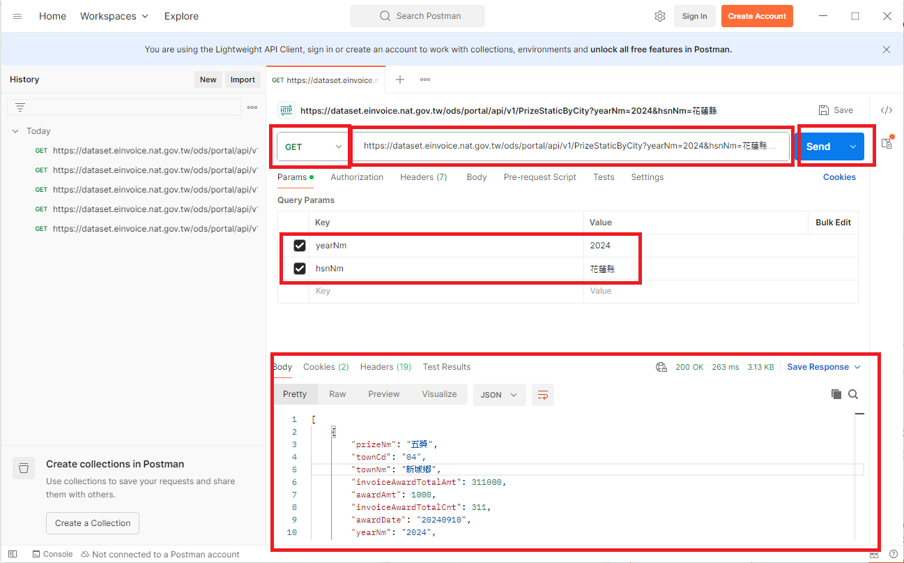

# 第三週：FastAPI 基礎與 API 開發

Week 3: FastAPI Basics and API Development

## 課程概述 Course Overview

本週將介紹 FastAPI 框架的基礎知識，並實作第一個 Web API。我們會從 Postman 的安裝與使用開始，到建立翻譯功能的 API 串接，同時學習 Python 虛擬環境的設置與使用。

This week introduces the basics of the FastAPI framework and implements the first Web API. We will start from installing and using Postman, to creating translation function API integration, while learning about Python virtual environment setup and usage.


## 學習目標 Learning Objectives

- 了解 FastAPI 框架的基本概念
  Understand the basic concepts of FastAPI framework
- 掌握 Postman 的使用方法
  Master the usage of Postman
- 建立第一個 Web API
  Create the first Web API
- 學習 Python 虛擬環境的管理
  Learn Python virtual environment management

## 章節 Chapters

1. Postman 安裝與教學
   Postman Installation and Tutorial
2. FastAPI 基礎介紹
   FastAPI Basic Introduction
3. 第一個 Web API 實作
   First Web API Implementation
4. Python 虛擬環境設置
   Python Virtual Environment Setup
5. 翻譯功能 API 串接
   Translation Function API Integration

## 課程內容 Course Content

### 1. Postman 安裝與教學

Postman Installation and Tutorial

#### **什麼是 Postman What is Postman**

Postman 是一個用於測試 API 的強大工具：
Postman is a powerful tool for testing APIs:

- 可以發送各種 HTTP 請求
  Can send various HTTP requests
- 提供友善的使用者介面
  Provides user-friendly interface
- 支援自動化測試
  Supports automated testing

#### **安裝步驟 Installation Steps**

1. 前往 Postman 官網下載
   Go to Postman official website to download
   [https://www.postman.com/downloads/](https://www.postman.com/downloads/)
2. 執行安裝程式
   Run the installer
3. 註冊帳號（可選）
   Register account (optional)

   

#### **基本使用方法 Basic Usage**

[電子發票開放資料Open API服務](https://www.einvoice.nat.gov.tw/portal/ods/ODS318E/einvoice_open_data)

1. 創建新的請求
   Create a new request

   - 點擊 "New" 按鈕
     Click the "New" button
   - 選擇 "HTTP Request"
     Select "HTTP Request"
2. 設置請求方法和 URL
   Set request method and URL

   - 從下拉選單選擇 HTTP 方法（GET, POST, PUT, DELETE 等）
     Select HTTP method from dropdown (GET, POST, PUT, DELETE, etc.)
   - 輸入目標 URL
     Enter target URL
3. 發送請求並查看響應
   Send request and view response

   - 點擊 "Send" 按鈕
     Click the "Send" button
   - 在下方查看響應內容
     View response content below

#### **實際操作示範 Practical Demonstration**

讓我們測試一個公開 API：
Let's test a public API:

1. 方法：GET
   Method: GET
2. URL：

   ```
   https://dataset.einvoice.nat.gov.tw/ods/portal/api/v1/PrizeStaticByCity?yearNm=2024&hsnNm=花蓮縣
   ```
3. 點擊 "Send"，查看返回的 JSON 數據
   Click "Send" and check the returned JSON data

   

### 2. FastAPI 基礎介紹

FastAPI Basic Introduction


#### **FastAPI 特點 FastAPI Features**

- 高性能
  High performance
- 快速開發
  Fast development
- 自動 API 文檔
  Automatic API documentation
- 基於現代 Python 類型提示
  Based on modern Python type hints
- 內建數據驗證
  Built-in data validation

#### **安裝 FastAPI Installation**

使用 pip 安裝 FastAPI 和 Uvicorn（ASGI 服務器）：
Install FastAPI and Uvicorn (ASGI server) using pip:

```bash
pip install fastapi
pip install uvicorn[standard]
```

#### **FastAPI 與其他框架的比較 Comparison with Other Frameworks**

| 框架 Framework | 優點 Advantages            | 缺點 Disadvantages       |
| -------------- | -------------------------- | ------------------------ |
| FastAPI        | 高性能、自動文檔、數據驗證 | 相對較新、社區較小       |
| Flask          | 簡單、靈活、大社區         | 性能較低、無內建數據驗證 |
| Django         | 全功能、ORM、管理界面      | 較重、學習曲線陡峭       |

### 3. 第一個 Web API 實作

First Web API Implementation

#### **建立基本 API 結構 Create Basic API Structure**

創建一個名為 `main.py` 的文件：
Create a file named `main.py`:

```python
from fastapi import FastAPI

app = FastAPI()

@app.get("/")
def read_root():
    return {"Hello": "World"}

@app.get("/items/{item_id}")
def read_item(item_id: int, q: str = None):
    return {"item_id": item_id, "q": q}
```

#### **運行 API 服務器 Run API Server**

使用 Uvicorn 運行服務器：
Run the server using Uvicorn:

```bash
uvicorn main:app --reload
```

- `main`: Python 模塊名稱
  Python module name
- `app`: FastAPI 實例對象
  FastAPI instance object
- `--reload`: 代碼變更時自動重新加載
  Automatically reload when code changes

#### **訪問 API 文檔 Access API Documentation**

FastAPI 自動生成的文檔：
FastAPI automatically generated documentation:

- Swagger UI: http://127.0.0.1:8000/docs
- ReDoc: http://127.0.0.1:8000/redoc

#### **使用 Postman 測試 API Testing API with Postman**

1. 測試根路徑
   Test root path

   - GET http://127.0.0.1:8000/
   - 預期響應 Expected response: `{"Hello": "World"}`
2. 測試帶參數的路徑
   Test path with parameters

   - GET http://127.0.0.1:8000/items/5?q=test
   - 預期響應 Expected response: `{"item_id": 5, "q": "test"}`

### 4. Python 虛擬環境設置

Python Virtual Environment Setup

#### **為什麼需要虛擬環境 Why Virtual Environments**

- 隔離項目依賴
  Isolate project dependencies
- 避免版本衝突
  Avoid version conflicts
- 方便項目移植
  Easy project portability
- 保持系統 Python 環境乾淨
  Keep system Python environment clean

#### **使用 venv 創建虛擬環境 Create Virtual Environment with venv**

Windows:

```bash
python -m venv transEnv
transEnv\Scripts\activate
```

macOS/Linux:

```bash
python3 -m venv transEnv
source transEnv/bin/activate
```

#### **退出虛擬環境 Exit Virtual Environment**

當完成工作後，可以使用以下命令退出虛擬環境：
When you finish working, you can exit the virtual environment with the following command:

```bash
deactivate
```

執行後，命令提示符前的 `(transEnv)` 前綴將會消失，表示您已經回到系統的全局 Python 環境。
After execution, the `(transEnv)` prefix before the command prompt will disappear, indicating that you have returned to the system's global Python environment.

#### **刪除虛擬環境 Delete Virtual Environment**

如果您不再需要某個虛擬環境，可以直接刪除其資料夾來移除它：
If you no longer need a virtual environment, you can simply delete its folder to remove it:

Windows:

```bash
# 確保先退出虛擬環境
# Make sure to exit the virtual environment first
deactivate
# 刪除虛擬環境資料夾
# Delete the virtual environment folder
rmdir /s /q transEnv
```

macOS/Linux:

```bash
# 確保先退出虛擬環境
# Make sure to exit the virtual environment first
deactivate
# 刪除虛擬環境資料夾
# Delete the virtual environment folder
rm -rf transEnv
```

刪除後，該虛擬環境及其安裝的所有套件都將被移除。
After deletion, the virtual environment and all packages installed in it will be removed.

#### **在虛擬環境中安裝依賴 Install Dependencies in Virtual Environment**

```bash
pip install fastapi uvicorn[standard] googletrans
```

#### **管理依賴 Managing Dependencies**

生成 requirements.txt:
Generate requirements.txt:

```bash
pip freeze > requirements.txt
```

從 requirements.txt 安裝:
Install from requirements.txt:

```bash
pip install -r requirements.txt
```

### 5. 翻譯功能 API 串接

Translation Function API Integration

#### **整合上週的翻譯功能 Integrate Last Week's Translation Function**

創建 `translator.py`:
Create `translator.py`:

```python
from googletrans import Translator

def translate_text(text, dest='en', src='auto'):
    """
    翻譯文本
    Translate text
  
    Args:
        text (str): 要翻譯的文本 Text to translate
        dest (str): 目標語言 Target language
        src (str): 源語言 Source language
  
    Returns:
        dict: 包含翻譯結果的字典 Dictionary containing translation results
    """
    translator = Translator()
    translation = translator.translate(text, dest=dest, src=src)
  
    return {
        "original_text": text,
        "translated_text": translation.text,
        "source_language": translation.src,
        "target_language": translation.dest
    }
```

#### **創建翻譯 API 端點 Create Translation API Endpoint**

更新 `main.py`:
Update `main.py`:

```python
from fastapi import FastAPI, HTTPException
from pydantic import BaseModel
from translator import translate_text

app = FastAPI()

class TranslationRequest(BaseModel):
    text: str
    target_language: str = "en"
    source_language: str = "auto"

@app.get("/")
def read_root():
    return {"message": "Welcome to Translation API"}

@app.post("/translate/")
def translate(request: TranslationRequest):
    try:
        result = translate_text(
            request.text,
            dest=request.target_language,
            src=request.source_language
        )
        return result
    except Exception as e:
        raise HTTPException(status_code=500, detail=str(e))
```

#### **使用 Postman 測試翻譯 API Test Translation API with Postman**

1. 設置 POST 請求到 http://127.0.0.1:8000/translate/
   Set up POST request to http://127.0.0.1:8000/translate/
2. 設置請求體（JSON）：
   Set request body (JSON):

   ```json
   {
     "text": "你好，世界！",
     "target_language": "en",
     "source_language": "auto"
   }
   ```
3. 發送請求並查看翻譯結果
   Send request and check translation results

## 課程重點 Key Points

- FastAPI 是一個現代、高性能的 Python Web 框架
  FastAPI is a modern, high-performance Python web framework
- Postman 是測試 API 的重要工具
  Postman is an important tool for testing APIs
- 虛擬環境可以有效管理 Python 項目依賴
  Virtual environments effectively manage Python project dependencies
- API 開發需要考慮請求參數驗證和錯誤處理
  API development requires consideration of request parameter validation and error handling
- 整合第三方服務（如翻譯 API）可以擴展應用功能
  Integrating third-party services (like translation APIs) can extend application functionality

## 課程練習 Exercises

### 練習 1: 基本 FastAPI 應用

Exercise 1: Basic FastAPI Application

創建一個簡單的 FastAPI 應用，包含以下端點：
Create a simple FastAPI application with the following endpoints:

1. GET `/hello` - 返回 "Hello, FastAPI!"
   Return "Hello, FastAPI!"
2. GET `/hello/{name}` - 返回 "Hello, {name}!"
   Return "Hello, {name}!"

### 練習 2: 擴展翻譯 API

Exercise 2: Extend Translation API

擴展翻譯 API，添加以下功能：
Extend the translation API with the following features:

1. 添加一個新端點 `/languages`，返回支持的語言列表
   Add a new endpoint `/languages` that returns a list of supported languages
2. 在翻譯端點添加字數統計功能
   Add word count functionality to the translation endpoint

### 練習 3: Postman 集合

Exercise 3: Postman Collection

創建一個 Postman 集合，包含對所有 API 端點的測試：
Create a Postman collection with tests for all API endpoints:

1. 測試基本端點
   Test basic endpoints
2. 測試翻譯功能
   Test translation functionality
3. 測試錯誤處理
   Test error handling

## 課程總結 Summary

本週我們學習了 FastAPI 框架的基礎知識，並實現了第一個 Web API。我們從 Postman 的安裝與使用開始，學習了如何測試 API 端點。接著，我們深入了解了 FastAPI 的特點和基本用法，創建了一個簡單的 API 服務。

我們還學習了 Python 虛擬環境的重要性和使用方法，這對於管理項目依賴至關重要。最後，我們將上週學習的翻譯功能整合到 API 中，創建了一個實用的翻譯服務。

通過本週的學習，你已經掌握了 Web API 開發的基礎知識，並能夠使用 FastAPI 創建自己的 API 服務。下週我們將學習如何將 API 與數據庫整合，進一步擴展應用的功能。

This week we learned the basics of the FastAPI framework and implemented our first Web API. We started with installing and using Postman to learn how to test API endpoints. Then, we delved into the features and basic usage of FastAPI, creating a simple API service.

We also learned about the importance and methods of using Python virtual environments, which is crucial for managing project dependencies. Finally, we integrated the translation functionality from last week into the API, creating a practical translation service.

Through this week's learning, you have mastered the basics of Web API development and can create your own API services using FastAPI. Next week, we will learn how to integrate APIs with databases to further expand the functionality of applications.
